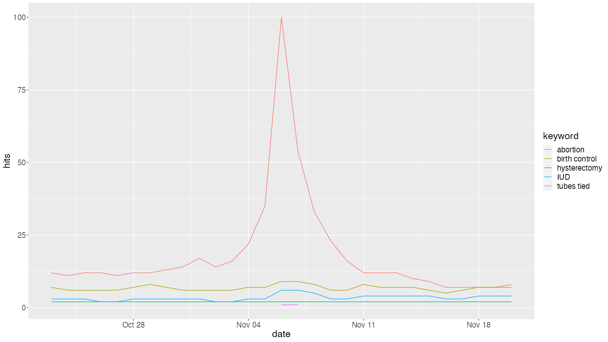
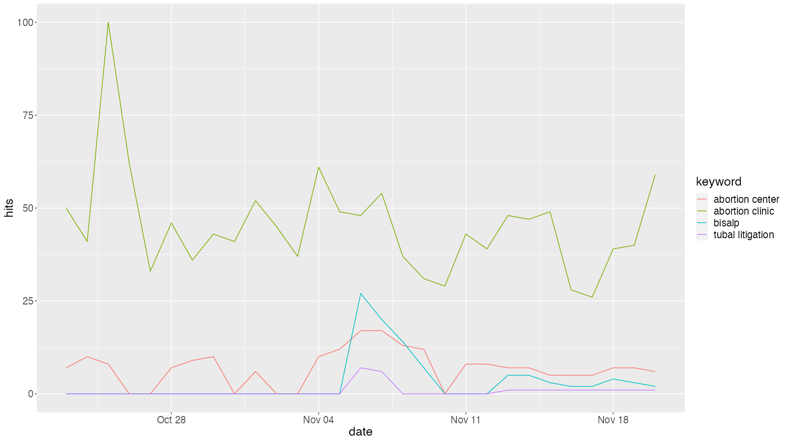

### GitHub repo with code, datasets, and html files of visualizations: https://github.com/bnowen/FischFriedman-Owen-FinalProject 

## Introduction

In this analysis, we explore how Google search volume related to abortion, birth control, and reproductive healthcare changed before and after the 2024 presidential election in the US by state and metropolitan area. We use the gtrendsR package to extract search history data for related terms through the Google Trends API. Our unit of analysis is search result density and any changes across our tracked time periods. We track search results by metro area (N=210) and state (N=51) for an additional, larger-scale perspective, as several states had abortion measures on the ballot for this election. Analysis was conducted on the Top 5 terms with the largest relative search volume after considering thirteen search terms. Our initial, exploratory analysis was conducted using plots from base R and the ggplot2 package. From there, we utilized ggplot2 and plotly to create two interactive bubble plot charts that allow users to compare a search term (the color of a bubble) by its search volume (size of the bubble and x-axis) for each region or state (y-axis) over time in two-day increments (secondary x-axis). Users are able to hover over each bubble for more information on the exact search volume, location, and date. 

## Methodology
We used Google Trends to examine popular search terms related to abortion, birth control, and reproductive healthcare changed before and after the 2024 presidential election in the US. Using the Google Trends API through the gtrendsR package, we extracted search volume history between October 23 - November 19, the two weeks before and after the election, for 13 terms related to abortion and reproductive health care during this time period in Google Trends in 3 groups. Group 1 included abortion, birth control, IUD, tubes tied, and hysterectomy; group 2 included vasectomy, family planning, plan B, and birth control implant; and group 3 included tubal ligation, bisalp, abortion clinic, and abortion center. We then plotted the 13 search terms. 

\newpage
*Figure 1: Group 1 Google Search Terms Over Time*
``` {r, echo=FALSE, out.width="100%"}

```


*Figure 2: Group 2 Google Search Terms Over Time*
``` {r, echo=FALSE, out.width="100%"}

```

\newpage
*Figure 3: Group 3 Google Search Terms Over Time*
``` {r, echo=FALSE, out.width="100%"}

```

Abortion and Plan B were the most common search terms in their respective groups, each peaking on November 6, the day after the election. Abortion clinic was the most common search term in its group, but it peaked before the election. For our analysis, we chose those that were consistently popular or with highly variable popularity during this time period to use in our analysis: abortion, bisalp, plan B, abortion clinic, and vasectomy.

## Dataset

The data was extracted using the gtrendsR package through the Google Trends API. We pulled gtrends results each at the state level and at the metropolitan region level, for our five selected search terms in 2 day intervals between October 23 - November 19, for a total of 14 results. At both the state and metropolitan area, each of 14 queries were converted to tibbles. After creating a date variable with a value of its respective date range, rbind was used to bind the tibbles into two final datasets. The final state-level dataset contains 3,570 observations of 6 columns: ‘location’, ‘hits’, ‘keyword’, ‘geo’ (country of origin), ‘gprop’ (the information source, in this case the web), and the manually assigned ‘date’ variable. All of these variables are characters except for ‘hits’, which is an integer. The final metropolitan region-level dataset contains 14,700 observations with the same columns and column types as the state-level dataset. 

## Analysis/Visualization
We considered multiple plot types in relation to the focus of our dataset structure, including line charts, static bubble charts, and time series bubble charts, as these types of plots would be useful in we chose between prioritizing displaying search term volume or prioritizing visibility of the clusters by state and region. While we contemplated using a map as the stage for our time series bubbles to make it easier to see where search terms were popular, we ultimately decided that prioritizing over search volume over geography was closer to our focus on overall Internet activity. However, we kept state- or region-level data as a secondary focus by assigning them as our y-axis attribute in each figure. 

We used the ggplot2 and plotly packages in R to create two interactive bubble charts that allow users to compare a search term (the color of a bubble) by its search volume (size of the bubble and x-axis) for each region or state (y-axis) over time in two-day increments (secondary x-axis). Users are able to hover over each bubble for more information on the exact search volume, location, and date. Each search term item in the legend can be clicked to add or remove its bubbles from the figure; this effect is cumulative. Time increments as scripted as animations. To view the entire y-axis, a full-sized computer monitor or the zoom in function must be used, though all data points are plotted regardless and can be viewed by hovering over individual bubbles. The plots were saved as .html files in the GitHub repository linked at the start of the paper using the htmlwidgets package in R. A still image from the animation for search terms by state is below.

*Figure 4. Still Image of Visualization for Search Trends by State*

``` {r, echo=FALSE, out.width="100%"}

```

The final interactive figures provide some key, exploratory insights to overall search trends for our keywords. At the state level, the search volumes for “abortion” and “Plan B” spiked between October 23 to October 26 and October 29 to November 5. There was a large surge in many states for the term “vasectomy” on October 27 and 28. Between November 6 and 7, the days immediately following the  election, there was a massive increase in the search volume for “vasectomy”, “Plan B”, and “bisalp”, with the highest reproductive health term search increases in states that voted primarily Republican; the term “bisalp” peaked during that time in Texas (it reached a search volume of 100). Between November 8 and November 13, “abortion” once again leads in search volume. Finally, we see a surge in search volume for “vasectomy”, “Plan B”, and “bisalp” from November 14 - November 19. 

At the metropolitan region level, between October 23 and October 24, “vasectomy”, “Plan B”, and “abortion” had high search volume in metropolitan areas of some predominantly Republican states. From October 25 to October 28, “vasectomy” grew in search volume overall. On November 3 - November 4, “abortion” gained popularity in many regions, demonstrating higher interest in the days leading up to the election. 

## Conclusions

Our final figures function as exploratory analyses with more granularity and flexibility than those available in Google Trends. However, they are not without limitations. Firstly, Google Trends provides relative search volume, with the largest search volume that is queried set to 100, and the other searches scaled to that. This doesn't allow for understanding or visualization the actual search volume. While we can show relative change in search volume over time, we do not know how many searches for abortion and related terms there were for our time period of interest. Additionally, because location is a secondary priority to displaying overall search volume, it may be difficult for users to observe search trends by location. Displaying search results alone does not provide users with the context of current events. The metropolitan region-level figure may also display high search volumes related to local events and does not easily account for state-level changes such as ballot measures and statewide. For these reasons, we intend that these figures be used to measure levels of interest across a high-traffic time period and serve as a jumping-off point for users curious about abortion and reproductive health trends. For example, all of the states with abortion measures on the ballot had surges of search volume for “abortion” at the state and some major metropolitan region level in the days leading up to the election, demonstrating high public interest. Keywords surrounding forms of pregnancy prevention - “vasectomy”, “Plan B”, and “bisalp” - remain high in search volume two weeks after the election, suggesting that pregnancy prevention has remained on many minds. Continued tracking of these keywords could reveal whether public interest in pregnancy prevention remains of heightened interest with the approach of a more conservative Presidential administration. 


